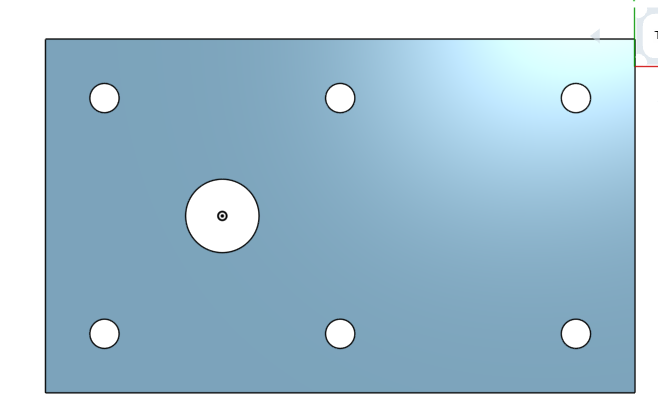
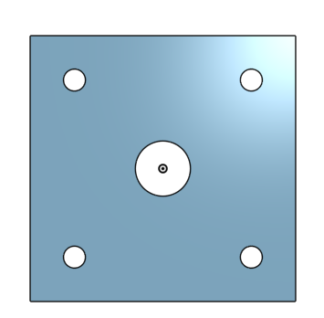
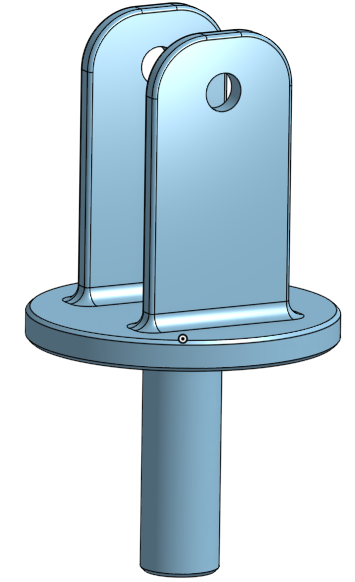
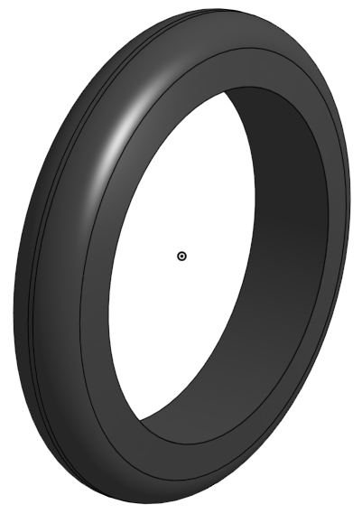
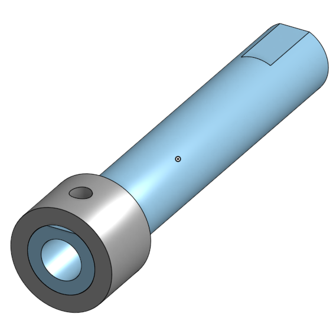
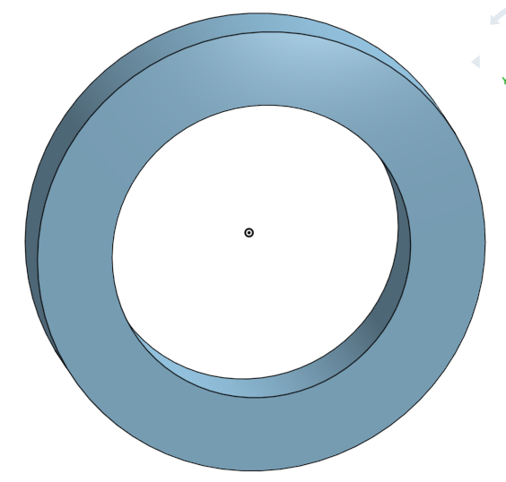
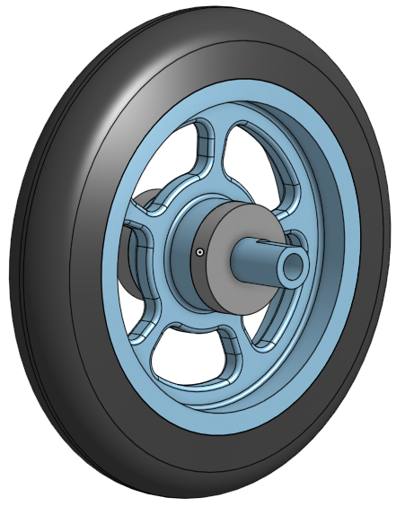
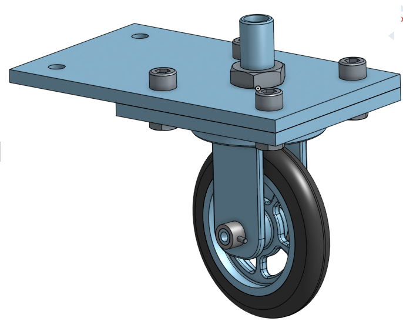

# Basic Onshape CAD
This is a repository for my CAD projects.

## Caster Base
### Image

### Reflection
This project was not very difficult. It was the first project I have completed using the OnShape program for the curriculum and am looking forward to continuing to use OnShape for the rest of the year!

## Caster Mount
### Image 

### Reflection
This project was very quick and simple. It gave my more practice creating and extruding sketches, as well as using linear patters. I did not run into any trouble while doing this part. 

## Caster Fork
### Image

### Reflection
This project was again quite quick and simple. The intructions were less of a step by step walkthrough which I liked because it allowed me to have to think back to what I've learned and find things for myself instead of being able to rely on a set of intructions. I did not have any trouble while completing this part and found it to be quite fun. Here is the link to my OnShape Document: https://cvilleschools.onshape.com/documents/68b8b6bbe3da71f21d830552/w/f6f99315c99cbb8ab51ee638/e/4d89120f856f843533ea3037

## Caster Tire
### Image

### Reflection
This project was quick and easy but some parts of it were somewhat tricky. The dimensions of the trapezoid confused me at first but after looking at the first diagram that explained to me what to click I understood it all. I'm looking forward to finishing my Caster soon. Here is the link to my OnShape Document:
https://cvilleschools.onshape.com/documents/d7c2514fda169fb08a937189/w/777b1ff53b3fbf68c23cff5d/e/7ba9519d0c23e6a8ead35cb8

## Caster Wheel
### Image

### Reflection
This project was a little harder than the other because I had some trouble creating the sketch for my circular pattern. However, after watching the video Mr. Helmstetter made, I was able to complete the part easily. Here is the link to my OnShape Document:
https://cvilleschools.onshape.com/documents/19aa58f836bc89451125d0c4/w/200e71ee09146c62147a511e/e/9205da3110747e811c3380b0

## Caster Axle, Collar and Bearings
### Images 

### Reflection
I enjoyed completing this project because I was given the satisfaction of knowing that I completed all the parts needed for my first project. Additionally, I loved being able to make two different parts within the same document. I learned more about how to use the Use tool in OnShape and its purpose. Here are the links to my documents:

Axle and Collar: https://cvilleschools.onshape.com/documents/da32e8ff41670a6a4550c368/w/f91f12e3a29ed19b14ff5e59/e/147271d00c97a6794768e68f
Bearing: https://cvilleschools.onshape.com/documents/bdc52f322f1bea62cf503bd3/w/944f7e20c57597a27bc71db1/e/78d51b9df86e8c89469cca3e 

## Sub-Assembly
### Image 

### Reflection
I enjoyed completing this sub-assembly because it gave me my first look at using mates withing OnShape. Personally, I found this new way of mating, though slightly more confusing, to be a lot easier than mating was on SolidWorks. Furthermore, importing parts into OnShape assemblies is far easier than it was using SolidWorks. Here is the link to my OnShape Document:
https://cvilleschools.onshape.com/documents/8b23722e83846d439badeeee/w/04b59a144532f6e87a88e447/e/3464d55a87bdd64e8fcf92af

## Final Assembly
### Image

### Reflection
Complete! I finished my first project in OnShape and it feels great! I enjoyed doing this project and feel extremely satisfied with what I have accomplished. I had some trouble when attempting to insert the nuts and bolts however I figured out my issues and was able to complete the assembly. Here is the link to my OnShape Document:
https://cvilleschools.onshape.com/documents/0c7103267c61c6da83459d50/w/da11724371d908aee973b3d3/e/6241f12feb0f03df29876857
