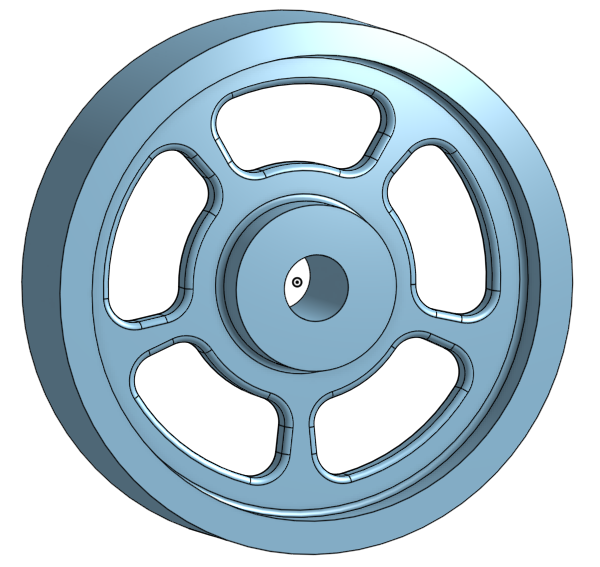

# Basic Onshape CAD
I made a Caster. 
I made some a picture frame.

---
## Table of Contents
* [Table of Contents](#Table-of-Contents)
* [Base](#Base)
* [Mount](#Mount)
* [Fork](#Fork)
* [Tire](#Tire)
* [Wheel](#Wheel)
* [AxleCollarBearings](#AxleCollarBearings)
* [Dorothy's Dowel Pins](#Dorothy'sDowelPins)

## Base

### Description

The first assignment of the Caster was to create the base. The base's dimensions are 200 mm x 120 mm and 8 mm thick.  It has 6 holes 10 mm wide and 20 mm from the edge equally spaced along the edges.

### Evidence 
https://cvilleschools.onshape.com/documents/663d0ac700b65edb39d2e882/w/6f5f054615acc12fc6a66a02/e/874b281a06256a1b34c70602

### Image

### Reflection

This project was not very difficult. I learned how to use shortcut keys within OnShape and got used to the differences within the program. It was the first project I have completed using the OnShape program for the curriculum and am looking forward to continuing to use OnShape for the rest of the year! 

---

## Mount

### Description

The mount was quick and easy to make. I followed the step-by-step instructions that were given to me because I wanted to make sure I completed the part correctly and understood how to use the linear pattern feature. 

### Evidence
https://cvilleschools.onshape.com/documents/b0d69b34b5f7f54ef4e5a89c/w/c9ccce9a9c12f3420cce18d3/e/6ccdb405857849e0f4c50a35

### Image 

### Reflection

This project was very quick and simple. It gave my more practice creating and extruding sketches, as well as using linear patterns. I did not run into any trouble while doing this part and I found it to be very easy. 

--- 

## Fork

### Description

This part was relatively easy to make. I remebered completing it last year however I had to follow the instructions to make sure I completed everything correctly. I was introduced to the mirror tool in this part and was astonished at how easy it was to mirror features. 

### Evidence
https://cvilleschools.onshape.com/documents/68b8b6bbe3da71f21d830552/w/f6f99315c99cbb8ab51ee638/e/4d89120f856f843533ea3037

### Image

### Reflection

This project was again quite quick and simple. The intructions were less of a step by step walkthrough which I liked because it allowed me to have to think back to what I learned while completing the intro course on OnShape and find things for myself instead of being able to rely on a set of intructions. I did not have any trouble while completing this part and found it to be quite fun. 

---

## Tire

### Description

Overall, creating this part was extremely easy. The sketch was very easy to make and using the revolve feature was very straight-forward. However, while dimensioning my sketch, I had a hard time figuring out how to make it appear the same as the image that was given. After looking at the explanation for what to click, I understood how to correctly dimension was sketch and finished the part up easily. 
While completing this part, I had my ups and downs. 

### Evidence
https://cvilleschools.onshape.com/documents/d7c2514fda169fb08a937189/w/777b1ff53b3fbf68c23cff5d/e/7ba9519d0c23e6a8ead35cb8

### Image

### Reflection
This project was quick and easy but some parts of it were somewhat tricky. The dimensions of the trapezoid confused me at first but after looking at the first diagram that explained to me what to click I understood it all. I'm looking forward to finishing my Caster soon. 

---

## Wheel

### Description

Creating the actual wheel was very easy, especially since I learned how to do the dimensions needed for this part in the previous part. However, I had some trouble when trying to create the spokes of the wheel. But luckily, my teacher Mr. Helmstetter created a video explaining how to sketch the spokes of the wheel.

### Evidence
https://cvilleschools.onshape.com/documents/19aa58f836bc89451125d0c4/w/200e71ee09146c62147a511e/e/9205da3110747e811c3380b0

### Image

### Reflection
This project was a little harder than the other because I had some trouble creating the sketch for my circular pattern. However, after watching the video Mr. Helmstetter made, I was able to complete the part easily. 

---

## AxleCollarBearings

### Description

Creating these parts was as straight-forward and easy as could be. I followed the video that Dr. Shields created and was able to complete the parts very quickly. I learned more about the merge scope and making more than one part within a single document. 

### Evidence
Axle and Collar: https://cvilleschools.onshape.com/documents/da32e8ff41670a6a4550c368/w/f91f12e3a29ed19b14ff5e59/e/147271d00c97a6794768e68f
Bearing: https://cvilleschools.onshape.com/documents/bdc52f322f1bea62cf503bd3/w/944f7e20c57597a27bc71db1/e/78d51b9df86e8c89469cca3e 

### Images 

### Reflection
I enjoyed completing this project because I was given the satisfaction of knowing that I completed all the parts needed for my first project. Additionally, I loved being able to make two different parts within the same document. I learned more about how to use the Use tool in OnShape and its purpose. 

---

## Sub-Assembly

### Description

Learning more about the new mate was extremely fun and simple. Mating different things together in OnShape is so much easier than it was in SolidWorks. I followed along with the video Dr. Shields made and surprisingly experienced no major errors when mating my parts together. The first time I tried to mate my bearing to my wheel, I found the two to be overlapping eachother, however that was an extremely easy fix and didn't take me long to correct. 

### Evidence
https://cvilleschools.onshape.com/documents/8b23722e83846d439badeeee/w/04b59a144532f6e87a88e447/e/3464d55a87bdd64e8fcf92af

### Image 

### Reflection
I enjoyed completing this sub-assembly because it gave me my first look at using mates withing OnShape. Personally, I found this new way of mating, though slightly more confusing, to be a lot easier than mating was on SolidWorks. Furthermore, importing parts into OnShape assemblies is far easier than it was using SolidWorks. 

---

## Final Assembly

### Description

This was the final piece to completing the puzzle that was the Caster. For this assignment, I had to mate the final parts together and add some nuts, bolts, and pins, to make my Caster look finished and professional. I enjoyed doing this project and feel extremely satisfied with what I have accomplished. I had some trouble when attempting to insert the nuts and bolts; however, I figured out my issues and was able to complete the assembly. 

### Evidence
https://cvilleschools.onshape.com/documents/0c7103267c61c6da83459d50/w/da11724371d908aee973b3d3/e/6241f12feb0f03df29876857

### Image

### Reflection
When looking back on all that I completed during the course of this project, I learned so much about OnShape and all of the special features that this program has. Personally, I believe that OnShape is better than SolidWorks because it is a smarter program and is easier to complete projects. I'm looking forward to continuing to use OnShape and cannot wait to see what other things I can create in the future. 

---

## Dorothy's Dowel Pins

### Description

